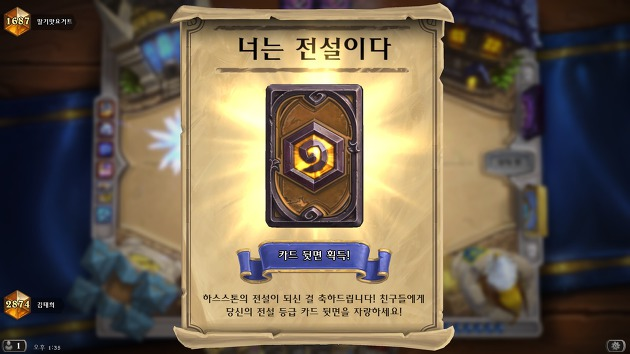
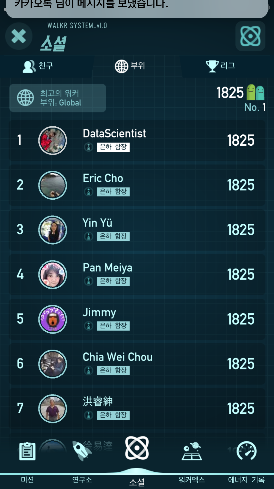

# This page is just for fun.

## Snowboarding

I started my first season 2011/12 in Muju Resort which is called Deogyusan Ski Resort now.

Every season, I got season pass in High1 Resort, Yangji Pine Resort, Daemyung Resort, or Jisan Forest Resort.

I prefer riding but not trick and jibbing at all.


## Tekkken series

I developed macro joystick for Tekken series and released the electric circuit and parts list as well as source code for micro controller(you can see this on my blog).

I was a Kuma/Panda player during Tekken 5 - 7, and ranked Usurper for Tekken 7 in Steam.


## Hearthstone

I loved to play games from Blizzard except the World of Warcraft but I don't play any game recently.



## Walker

I achieved ranked first in the world this mobile game named 'Walker' last year.

It had been around 3 years and I played every day at once(even I was abroad).

Thanks for all members in "Walker Korea".



<!--

Text can be **bold**, _italic_, or ~~strikethrough~~.

[Link to another page](./another-page.html).

There should be whitespace between paragraphs.

There should be whitespace between paragraphs. We recommend including a README, or a file with information about your project.

# Header 1

This is a normal paragraph following a header. GitHub is a code hosting platform for version control and collaboration. It lets you and others work together on projects from anywhere.

## Header 2

> This is a blockquote following a header.
>
> When something is important enough, you do it even if the odds are not in your favor.

### Header 3

```js
// Javascript code with syntax highlighting.
var fun = function lang(l) {
  dateformat.i18n = require('./lang/' + l)
  return true;
}
```

```ruby
# Ruby code with syntax highlighting
GitHubPages::Dependencies.gems.each do |gem, version|
  s.add_dependency(gem, "= #{version}")
end
```

#### Header 4

*   This is an unordered list following a header.
*   This is an unordered list following a header.
*   This is an unordered list following a header.

##### Header 5

1.  This is an ordered list following a header.
2.  This is an ordered list following a header.
3.  This is an ordered list following a header.

###### Header 6

| head1        | head two          | three |
|:-------------|:------------------|:------|
| ok           | good swedish fish | nice  |
| out of stock | good and plenty   | nice  |
| ok           | good `oreos`      | hmm   |
| ok           | good `zoute` drop | yumm  |

### There's a horizontal rule below this.

* * *

### Here is an unordered list:

*   Item foo
*   Item bar
*   Item baz
*   Item zip

### And an ordered list:

1.  Item one
1.  Item two
1.  Item three
1.  Item four

### And a nested list:

- level 1 item
  - level 2 item
  - level 2 item
    - level 3 item
    - level 3 item
- level 1 item
  - level 2 item
  - level 2 item
  - level 2 item
- level 1 item
  - level 2 item
  - level 2 item
- level 1 item

### Small image


### Large image


### Definition lists can be used with HTML syntax.

<dl>
<dt>Name</dt>
<dd>Woonghee Lee</dd>
<dt>Lives in</dt>
<dd>Ansan</dd>
</dl>

```
Long, single-line code blocks should not wrap. They should horizontally scroll if they are too long. This line should be long enough to demonstrate this.
```

```
The final element.
```
-->
